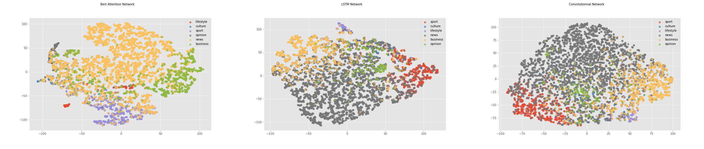
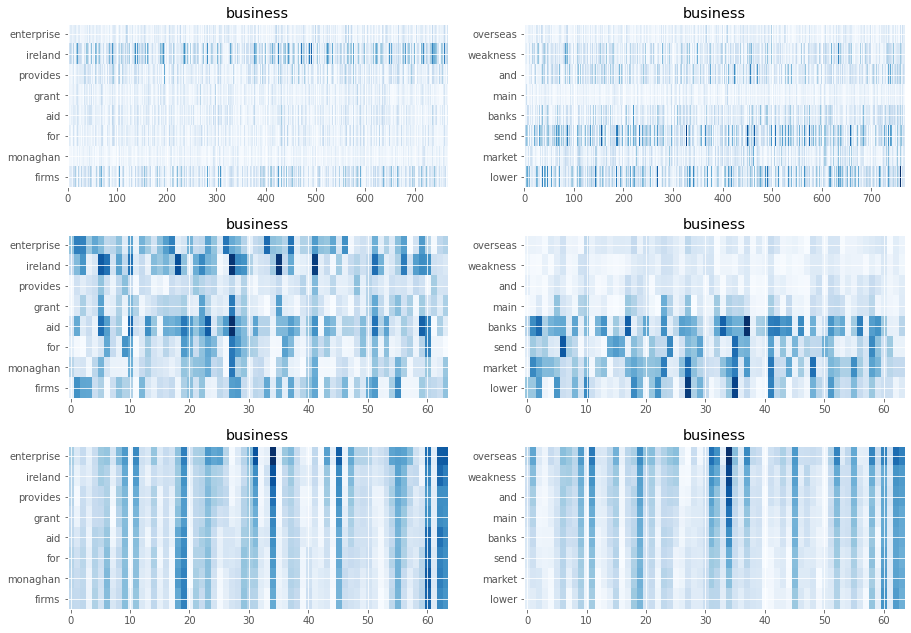

# Sentence Classification
A simple project on sentence classfication that i've done during my spare time

## Requirements

  * Python 3.3+ 
  * Keras & Tensorflow (ideally with a GPU for fast computation)
  * ktrain
  * keras-self-attention

## Dataset
The Dataset is a composition of 1.48 million headlines posted by The Irish Times operating within Ireland.
Each headline been associated to one of the six categories (news, sport, culture, lifestyle, business, opinion)

## Trained Models
I've implemented 4 differents models to classify the sentences on the dataset, all these preceded by a preprocessing step.

  * Historical method using TF-IDF along with a Logistic Regression
  * Embedding + LSTM 
  * Embedding + Convolution Network
  * Bert with self Attention Network
The .ipynb contains all the script to reproduce the results i obtained. It can be run on Google Colab. 

## Quantitaves Results
The performance in terms of precision of the models are in the following table : 

| Algorithm  | Precision |
| ------------- | ------------- | 
| BERT | 94.17 |
| Embedding + LSTM  | 79.31 | 
| Embedding + Convolution Network | 79.19 |
| TF-IDF | 78.18 | 

Bert with Attention outperforms the other methods

## Qualitative Results

I've plot a TSNE representation of the headlines a on a subset of the dataset along with some saliency map.

### 2-D TSNE

  

	* Culture and Opinion appears to be the class the most difficult to classify
### Saliency Map

  

	* For two sentences of the class Business, i compute the saliency map related to the learned embeddings for the models. At top Bert, followed by CNN and at bottom LSTM
	* Meanwhile BERT & CNN methods tend to capture the set of words that are the most discriminants for classifying the sentences, the LSTM approach learns embeddings which gradient are important for the classification regardless the words.
